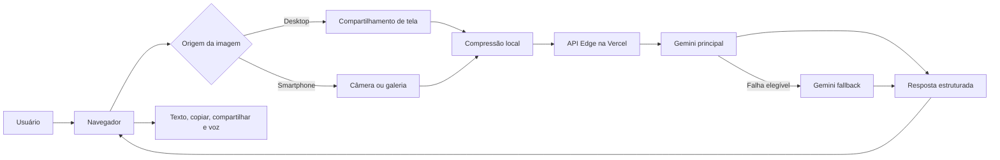

# Screen Assistant

Assistente visual 100% web que recebe uma captura autorizada da tela, uma foto da câmera ou uma imagem da galeria, envia a imagem para um backend leve na Vercel e usa o Gemini para produzir uma resposta estruturada em texto, com opção de leitura por voz.

> Projeto iniciado em 30 de julho de 2026 e desenvolvido de forma incremental por uma equipe de agentes coordenada pelo Mestre.

## Aplicação publicada

- Produção: https://screen-assistant-preview-20260731.vercel.app
- Hospedagem: Vercel
- IA atual: Gemini, com fallback entre dois modelos Gemini
- Interface: desktop, smartphone e PWA
- Design atual: Fase 15, com identidade Predix AI e jornada visual simplificada

## Problema original

O projeto nasceu da necessidade de demonstrar, de forma real e simples, um agente de IA operando inteiramente na nuvem e acessível pelo navegador. O sistema deveria:

1. solicitar permissão para capturar a tela do usuário;
2. enviar uma imagem para um backend leve;
3. interpretar o conteúdo por uma API com camada gratuita;
4. devolver uma resposta em texto ou voz;
5. priorizar simplicidade, privacidade e baixo custo;
6. manter alternativas quando uma camada gratuita falhasse.

A pesquisa inicial considerou Vercel, Cloudflare Workers, Supabase, Gemini e GLM. A implementação atual foi simplificada para Vercel + Gemini, preservando o histórico das alternativas estudadas na documentação.

## Funcionalidades atuais

- compartilhamento autorizado de tela no desktop;
- captura manual de um frame;
- câmera traseira no smartphone;
- seleção de imagem pela galeria;
- correção de orientação quando suportada pelo navegador;
- compressão local para WebP/JPEG antes do envio;
- limite de 2 MB por imagem;
- análise multimodal pelo Gemini;
- fallback entre modelo principal e modelo alternativo;
- respostas estruturadas em Markdown seguro;
- cópia em texto puro;
- leitura por voz no próprio dispositivo;
- modo compacto e modo desktop;
- barra de ações móvel;
- estados detalhados de progresso e cancelamento;
- instalação como PWA;
- sistema visual próprio com foco na jornada selecionar → perguntar → analisar;
- nenhuma persistência de imagens no aplicativo.

## Arquitetura atual



A chave do Gemini permanece exclusivamente no backend. O navegador nunca recebe `GEMINI_API_KEY`.

## Estrutura do repositório

```text
api/                    Funções Edge da Vercel
  health.js             Saúde do serviço
  ready.js              Prontidão e configuração não sensível
  v1/analyze-screen.js  Análise multimodal e fallback
public/                 Aplicação web e PWA
  app.js                Coordenação da interface
  design.js             Sincronização de estados visuais
  analysis.js           Requisição e estados da análise
  image.js              Compressão e orientação
  markdown.js           Markdown seguro
  response.js           Organização e compartilhamento
  pwa.js                Instalação da PWA
  service-worker.js     Cache somente do shell estático
tests/                  Testes automatizados
docs/                   História, arquitetura e decisões
```

## Requisitos

- Node.js 22 ou superior;
- navegador moderno;
- HTTPS ou `localhost` para recursos protegidos do navegador;
- projeto na Vercel;
- chave válida da API Gemini.

## Execução local

Este projeto não possui dependências externas de runtime.

```bash
npm test
npx vercel dev
```

Crie um arquivo `.env.local` baseado em `.env.example`:

```env
AI_MODE=gemini
GEMINI_API_KEY=sua_chave_local
GEMINI_MODEL=gemini-3.5-flash-lite
GEMINI_FALLBACK_MODEL=gemini-3.1-flash-lite
GEMINI_TIMEOUT_MS=25000
```

Nunca versionar `.env.local` ou chaves reais.

## Testes

```bash
npm test
```

A suíte cobre:

- captura de tela;
- câmera;
- galeria;
- compressão;
- Gemini e fallback;
- Markdown seguro;
- voz;
- layout mobile;
- PWA;
- estados de análise;
- hierarquia e preservação funcional do redesign da Fase 15.

## Deploy na Vercel

Consulte [docs/DEPLOYMENT.md](docs/DEPLOYMENT.md).

Variáveis obrigatórias:

| Variável | Finalidade |
|---|---|
| `AI_MODE` | Deve ser `gemini` |
| `GEMINI_API_KEY` | Segredo da API Gemini |
| `GEMINI_MODEL` | Modelo principal |
| `GEMINI_FALLBACK_MODEL` | Modelo alternativo |
| `GEMINI_TIMEOUT_MS` | Referência operacional de timeout |

Fluxo desejado para a integração Git:

```text
GitHub main → produção na Vercel
Pull Request/branch → Preview Deployment
```

## Segurança e privacidade

- a captura só começa por ação explícita do usuário;
- a aplicação envia somente a imagem escolhida ou o frame capturado;
- imagens não são persistidas pelo código da aplicação;
- respostas da API usam `Cache-Control: no-store`;
- o service worker não armazena chamadas de API, imagens nem respostas;
- HTML produzido pelo modelo é escapado;
- links inseguros são bloqueados;
- o usuário é orientado a não compartilhar dados sensíveis.

Consulte [SECURITY.md](SECURITY.md) e [docs/SECURITY-PRIVACY.md](docs/SECURITY-PRIVACY.md).

## Histórico de construção

A documentação registra a evolução desde a ideia original, incluindo decisões, testes, falhas e correções:

- [Origem e visão do produto](docs/PROJECT-ORIGIN.md)
- [Histórico completo das fases](docs/PROJECT-HISTORY.md)
- [Fluxo de agentes](docs/AGENT-WORKFLOW.md)
- [Arquitetura atual](docs/ARCHITECTURE.md)
- [Decisões arquiteturais](docs/DECISIONS.md)
- [Roadmap](docs/ROADMAP.md)
- [Relatórios por fase](docs/phases/)
- [Fase 15 — Redesign](docs/phases/PHASE-15-REDESIGN.md)

## Estado atual

```yaml
release: phase-15-redesign
version: 0.19.0
status: em_validacao
frontend: desktop_mobile_pwa
backend: vercel_edge
ia: gemini_multimodal
fallback: gemini_para_gemini
persistencia_de_imagem: nenhuma
repositorio: leon337/screen-assistant
```

## Limitações conhecidas

- captura contínua da tela de outros aplicativos no smartphone exige app nativo;
- disponibilidade e cotas dependem do provedor Gemini;
- o endpoint usa um token demonstrativo no frontend e ainda não possui autenticação real de usuários;
- não existe histórico em banco de dados;
- respostas muito extensas ainda podem exigir refinamento de concisão e continuação;
- instalação PWA varia conforme navegador e sistema operacional.

## Licença

Nenhuma licença de código aberto foi definida até o momento. O uso, cópia ou redistribuição depende de autorização do proprietário do repositório.
