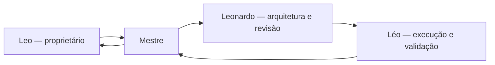

# Fluxo de trabalho entre agentes

## Estrutura adotada

O projeto foi conduzido por um fluxo encadeado de agentes, com uma única resposta consolidada ao usuário.



## Mestre

Responsabilidades:

- receber o objetivo do proprietário;
- definir fase, escopo e critérios de aceite;
- distribuir o trabalho;
- consolidar decisões e evidências;
- impedir promoção sem validação;
- entregar o resultado final ao proprietário.

## Leonardo

Responsabilidades:

- revisar arquitetura;
- identificar riscos e regressões;
- validar compatibilidade desktop/mobile;
- avaliar segurança e privacidade;
- aprovar ou solicitar correções;
- revisar critérios de aceite.

## Léo

Responsabilidades:

- implementar o escopo aprovado;
- executar testes;
- preparar pacotes e deploys;
- coletar evidências externas;
- informar falhas reais sem ocultar limitações;
- devolver a execução ao Mestre.

## Regras operacionais

- uma fase por vez;
- nenhuma alegação de conclusão sem evidência;
- erros encontrados geram correção e novo teste;
- segredos nunca são registrados em documentação ou código;
- o usuário autoriza decisões de escopo relevantes;
- a resposta final deve mostrar o fluxo completo da equipe.

## Exemplo de passagem de bastão

```text
[MESTRE → LEONARDO]
Planejamento, escopo e critérios.

[LEONARDO → LÉO]
Arquitetura aprovada, riscos e salvaguardas.

[LÉO → MESTRE]
Implementação, testes, deploy e evidências.

[MESTRE → LEO]
Resultado consolidado e próximos passos.
```
