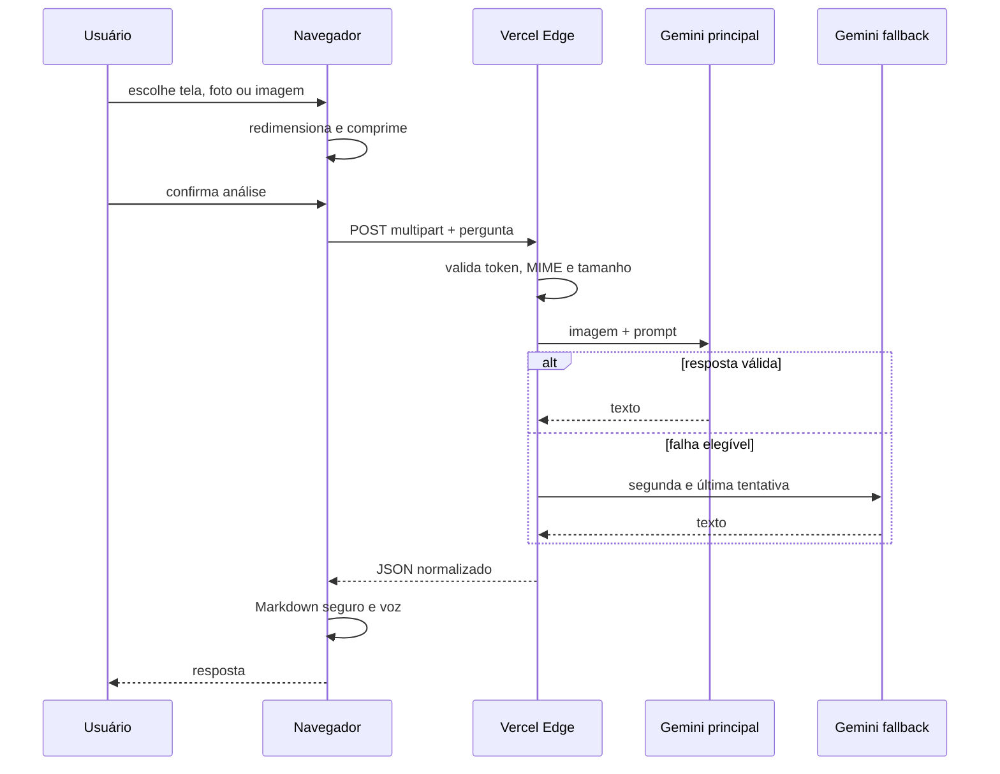

# Arquitetura atual

## Componentes

### Navegador

Responsável por:

- solicitar permissão de compartilhamento de tela;
- abrir câmera ou galeria;
- capturar e comprimir a imagem;
- enviar multipart para o backend;
- renderizar Markdown seguro;
- copiar, compartilhar e ler a resposta;
- registrar a PWA e manter somente o shell estático em cache.

### API Edge da Vercel

Responsável por:

- validar método e token demonstrativo;
- validar tipo e tamanho da imagem;
- construir prompt cauteloso;
- chamar o modelo principal;
- executar uma única tentativa de fallback elegível;
- normalizar erros;
- devolver `Cache-Control: no-store`.

### Gemini

A versão atual usa:

```text
modelo principal: GEMINI_MODEL
modelo alternativo: GEMINI_FALLBACK_MODEL
```

O fallback ocorre quando o primeiro modelo retorna timeout, 404, 429 ou erro 5xx. Não há ciclo de repetição ilimitado.

## Fluxo de dados



## Contrato principal

```http
POST /api/v1/analyze-screen
Authorization: Bearer preview-demo-token
Content-Type: multipart/form-data
```

Campos:

- `image`: WebP ou JPEG, até 2 MB;
- `question`: texto opcional, até 1000 caracteres no frontend.

## Endpoints operacionais

```text
GET /health
GET /ready
POST /api/v1/analyze-screen
```

## Decisões atuais

- DOM nativo e JavaScript ES modules;
- nenhuma dependência externa de frontend;
- Vercel Edge Functions;
- imagens somente em memória;
- PWA sem cache de API;
- fallback entre modelos Gemini;
- autenticação demonstrativa temporária.

## Arquitetura histórica

Fases intermediárias implementaram uma fundação mais ampla com Supabase Auth, Cloudflare Workers, GLM, rate limiting e circuit breaker. O runtime atual foi simplificado para acelerar a validação real. A retomada dessas camadas está registrada no roadmap.
